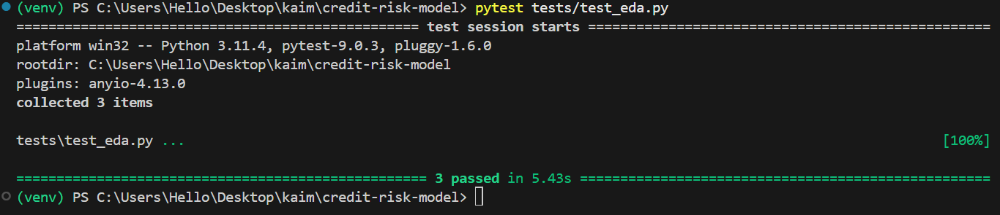

## Credit Risk Model
### Credit Scoring Business Understanding
#### 1. How does the Basel II Accord's emphasis on risk measurement influence the need for an interpretable and well-documented model?
- The Basel II Accord shifts the focus from model performance to model defensibility. Because credit risk models directly impact financial stability and borrower access, they are subject to regulatory scrutiny that demands full transparency. This mandates an interpretable architecture where every input has a traceable impact on the output and comprehensive documentation that serves as an audit trail for regulators. Consequently,  the modeling choices prioritize statistical interpretability over raw predictive power to ensure compliance, auditability, and ethical fairness.

#### 2. Without a direct "default" label, why is a proxy variable necessary, and what business risks does proxy-based prediction introduce?
- Because the dataset lacks historical loan default records, I employed an RFM-based clustering approach to derive a high-risk proxy variable. While this allows me to initiate model training, it introduces an inherent approximation risk. I acknowledge that behavioral disengagement is a categorical proxy not a financial certainty and thus, the model predicts the probability of behavioral risk rather than contractual default. To mitigate business risk, this model must be treated as one of several inputs in a human-in-the-loop loan origination process, and its performance must be validated against real-world repayment data as soon as the buy-now-pay-later service begins accumulating credit outcomes.

#### 3. What are the key trade-offs between a simple, interpretable model (e.g., Logistic Regression with WoE) and a high-performance model (e.g., Gradient Boosting) in a regulated financial context?
- In choosing between a simple, interpretable model (Logistic Regression with WoE) and a high-performance model (Gradient Boosting), there is a fundamental trade-off between predictive precision and regulatory transparency. While Gradient Boosting offers superior performance by capturing complex, non-linear data patterns, its black-box nature poses significant hurdles for the rigorous, documentable audit trails required by Basel II standards. Conversely, Logistic Regression provides a transparent, monotonic relationship between inputs and outcomes, aligning with the regulatory need for explainable AI. the strategy favors an initial focus on interpretable models to satisfy compliance requirements, with high-performance models utilized as secondary benchmarks to measure the accuracy gap and justify future model complexity.


**Strategic Choice for This Project**  
Given the regulatory environment at Bati Bank, I prioritize **interpretable models** (Logistic Regression with WoE encoding) as the primary approach to ensure auditability and Basel II compliance, while using Gradient Boosting models as benchmarks to quantify the performance-interpretability trade-off.

---

 #### 🏛️ Model Governance & Auditability

 In alignment with Basel II regulatory requirements, this project implements the following governance standards:
 * **Reproducibility:** Every analysis run is auto-timestamped and saved to a dedicated `outputs/` subdirectory, containing the exact `config.json` used for the run.
 * **Audit Trail:** The pipeline generates human-readable text reports (`eda_summary_report.txt`) alongside visual artifacts, ensuring that feature engineering decisions can be audited by risk management teams.
 * **Review Workflow:** This pipeline serves as the primary technical gate for data quality. By automating the identification of skewness and outliers, we ensure that every feature undergoes standardized vetting before model training.

--- 

# EDA Pipeline for Credit Risk Modeling

## Project Overview

This project implements a **clean, reusable, and well-architectured Exploratory Data Analysis (EDA) pipeline** for a financial transaction dataset used in **credit risk and fraud detection modeling**.

The pipeline was built to fully satisfy the given assignment requirements while maintaining production-grade code quality, reproducibility, and scalability.

The dataset contains transaction-level records from the Xente eCommerce platform, where each row represents a single customer transaction. The fields capture the who (customer, account, subscription identifiers), the what (product, category, channel, pricing strategy), and the how much / when (amount, value, transaction timestamp), along with a binary fraud flag. It can be found on Kaggle - https://www.kaggle.com/datasets/atwine/xente-challenge

---

## Task Requirements & Coverage

The assignment required the following:

### Completed Tasks:

1. **Overview of the Data** — Shape, columns, data types, memory usage
2. **Summary Statistics** — Central tendency, dispersion, skewness, kurtosis + automated insights
3. **Distribution of Numerical Features** — Histograms and count plots
4. **Distribution of Categorical Features** — Frequency analysis with top-N handling
5. **Correlation Analysis** — Pearson correlation matrix + heatmap
6. **Identifying Missing Values** — Detection with smart imputation advice
7. **Outlier Detection** — IQR method + **Box plots** for visual identification

**All 7 requirements are fully implemented.**

### EDA Coverage Summary (All Requirements Met)

- **Data Overview**: 95,662 rows × 16 columns, memory usage, dtypes reviewed
- **Summary Statistics**: Mean, median, std, skewness, kurtosis with automated insights
- **Distribution Analysis**: Histograms (numerical) + count plots (categorical)
- **Correlation Analysis**: Pearson matrix + heatmap (Amount-Value correlation ~0.99)
- **Missing Values**: Zero missing values found
- **Outlier Detection**: IQR method + box plots (Amount: 25.55% outliers)
- **Key Insights**: 5 detailed insights guiding feature engineering (skewness, imbalance, multicollinearity, etc.)

### EDA Findings Gallery
 
 
 *Automated artifacts generated by the pipeline:*
 | Feature Type | Artifact Type | Sample |
 | --- | --- | --- |
 | **Numerical** | KDE/Histogram | `outputs/.../plots/num_Amount.png` |
 | **Categorical** | Bar/Count Plot | `outputs/.../plots/cat_Product.png` |
 | **Multivariate** | Heatmap | `outputs/.../plots/correlation_heatmap.png` |
 | **Outliers** | Box Plot | `outputs/.../plots/boxplot_Amount.png` |

---

## Architecture Highlights

- **Pipeline-as-a-Class** design (`EDAPipeline`)
- Uses **inner classes** (`_Visualizer`, `_Reporter`) to avoid God Class anti-pattern
- Highly **configurable** through `EDAConfig` dataclass
- **Reproducible** — Timestamped output folders + saved `config.json`
- Method chaining support (`load_data().run()`)
- Separation of concerns (Analysis, Visualization, Reporting)
- Works well in **Jupyter Notebooks** (plots displayed inline + saved)

EDA outputs are timestamped for reproducibility. Summary reports and configuration files are committed to Git, while generated plots are gitignored due to file size

---
## Testing & Quality Assurance 

 To ensure production-grade reliability and prevent regressions, this project includes a robust suite of unit tests.
 **Test Coverage:**
 * **Input Validation:** Confirms the pipeline gracefully handles empty or null datasets.
 * **Pipeline Execution:** Validates that the full EDA run produces the required summary statistics and artifacts without failure.
 * **Logic Verification:** Tests the statistical insight logic (e.g., skewness thresholds) to ensure consistent reporting.


 **Test Results:**

 *Run tests locally using:* `pytest tests/test_eda.py`


---

## Key Features

- Automatic data sampling for large datasets
- Smart distribution insights (skewness & kurtosis interpretation)
- Professional text report with outliers and correlation summary
- All plots saved in organized `plots/` folder
- Box plots for every numerical feature
- Clean logging throughout the pipeline
- Fraud imbalance awareness built into insights

---

## 📁 Project Structure

```bash
credit-risk-model/
├── .github/workflows/ci.yml          
├── data/                             
│   ├── raw/                          
│   └── processed/                    
├── notebooks/
│   └── eda.ipynb                     
├── src/
│   ├── __init__.py
│   ├── eda_pipeline.py               
│   ├── data_processing.py           #future
│   └── api/                   
│       └──  main.py       
├── tests/
│   ├── __init__.py           
│   ├── test_eda.py           
│   └── test_results.png
├── outputs/                         
├── Dockerfile           # future
├── docker-compose.yml   # future
├── requirements.txt
├── .gitignore
└── README.md
```

---

##  How to Use

```python
from eda_pipeline import EDAPipeline, EDAConfig

# Load The Dataframe beforehand 
# Configuration
config = EDAConfig(
    sample_size=None,      # Set number for large data, leave None for all
    save_plots=True,
    include_plots=True,
    verbose=True      # to display inside the cells
)

# Run pipeline
pipeline = EDAPipeline(config)

results = (pipeline
           .load_data(df)        # df is the pandas DataFrame
           .run())

print("EDA completed successfully!")

```

## Dataset Insights (Fraud Detection Context)

- **Highly Imbalanced Target**: `FraudResult` has only **0.2%** positive cases.
- Extreme skewness in `Amount` and `Value`
- High outlier rates in monetary features
- `CountryCode` is constant → should be dropped
- Strong correlation between `Amount` and `Value`

---

## Technologies Used

- Python 3
- pandas, matplotlib, seaborn
- dataclasses, pathlib, logging
- Designed for Jupyter Notebook environment


---

**Author:** Kalkidan Kassahun  
**Date:** May 30, 2026 - first version 
**Context:** Credit Risk Modeling


